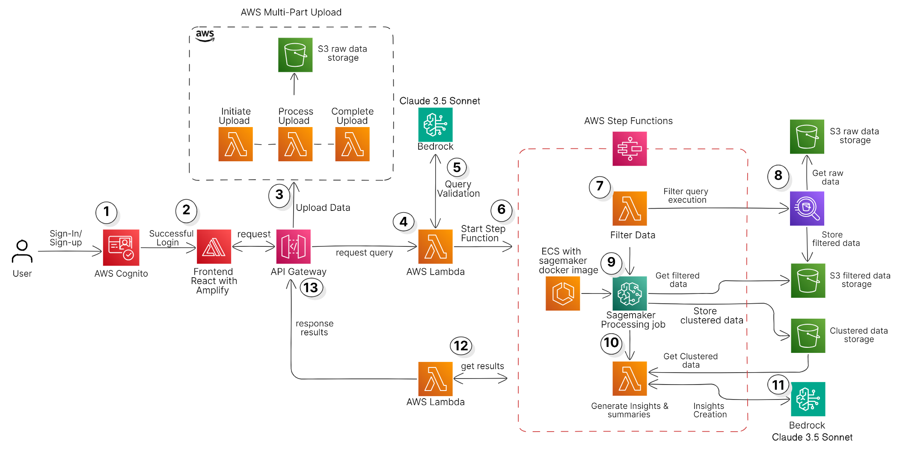

# Feedback Survey Insights

The Feedback Survey Insights Project is a complete cloud-native deployment solution designed to process large-scale employee feedback surveys efficiently. This system leverages multiple AWS services, including Amazon SageMaker, AWS Bedrock, AWS Lambda, S3, and API Gateway, to provide an end-to-end architecture for deep insights generation, recommendations, and summaries from survey data.

## Key Features:
Amazon SageMaker: Executes Machine Learning algorithm DBSCAN (Density-Based Spatial Clustering of Applications with Noise), for clustering survey comments. This helps in identifying recurring themes in feedback.

AWS Bedrock: Calls LLMs through AWS Bedrock to generate contextual insights and human-readable summaries from the clustered feedback data. This ensures actionable recommendations based on the clustered patterns.

AWS Lambda & API Gateway: Lambda functions coordinate the workflow and interact with the APIs. These APIs, exposed via API Gateway, are used to trigger data processing jobs, check their status, and retrieve the final insights and summaries. Once the APIs are deployed, users will receive the API URLs as output, allowing them to make requests and interact with the system dynamically.

AWS S3 Multi-part Upload: For faster and more efficient handling of large datasets, this project utilizes S3 multi-part upload. This ensures that even the largest survey files can be uploaded in a faster, more reliable way by splitting the data into chunks for parallel upload.



This system offers a complete end-to-end deployment solution, from uploading large datasets to running machine learning jobs and retrieving detailed results through APIs. After deploying the CDK stack, you will receive the API URLs in the output, which can be used to start processing jobs and check the results by appending the required resources (/process-query, /check-status, etc.) to the base URL.

By following the steps, users can seamlessly process large datasets and receive comprehensive insights and recommendations with minimal manual intervention.

### Prerequisites
- AWS CLI installed and configured with appropriate IAM permissions.
- AWS CDK installed globally on your system.
- Docker installed on your machine.
- AWS Account with permissions for ECR, Lambda, S3, Step Functions, and SageMaker.

- ### Step 1: Pull and Upload Docker Image to AWS ECR
    We will use a pre-configured Docker image that includes all necessary packages for processing feedback surveys using SageMaker.

    #### 1.1. Pull Docker Image from DockerHub
    Run the following command to pull the custom Docker image:

    ```bash
    docker pull btalachi/processing-sagemaker-image:latest
    ```
    #### 1.2. Create an AWS ECR Repository
    Next, we need to create an ECR repository where this image will be stored.

    ```bash
    aws ecr create-repository --repository-name sagemaker-processing-image --region <your-region>
    ```
    #### 1.3. Authenticate Docker to ECR
    You must authenticate Docker to your ECR repository. Run the following command:

    ```bash
    aws ecr get-login-password --region <your-region> | docker login --username AWS --password-stdin <aws-account-id>.dkr.ecr.<your-region>.amazonaws.com
    ```
    #### 1.4. Tag and Push Docker Image to ECR
    Tag your Docker image to match your ECR repository URI:

    ```bash
    docker tag btalachi/processing-sagemaker-image:latest <aws-account-id>.dkr.ecr.<your-region>.amazonaws.com/sagemaker-processing-image:latest
    ```
    Finally, push the image to ECR:

    ```bash
    docker push <aws-account-id>.dkr.ecr.<your-region>.amazonaws.com/sagemaker-processing-image:latest
    ```
    #### 1.5. Final ECR Image URI
    The final Docker image URI in ECR will look like:

    ```bash
    <aws-account-id>.dkr.ecr.<your-region>.amazonaws.com/sagemaker-processing-image:latest
    ```

    You will use this URI in the CDK configuration.

- ### Step 2: Download and Configure the Backend
    #### 2.1. Clone the Repository
    Clone the GitHub repository to your local environment:

    ```bash
    git clone https://github.com/ASUCICREPO/feedback_survey_insights.git
    cd feedback-survey-insights
    ```

    #### 2.2. Modify cdk.json
    Inside the backend folder, you will find a cdk.json file. You need to modify the context variables according to your configuration.

    Example cdk.json:

    ```bash
    "context": {
        "project_name": "FeedbackSurveyProject",
        "bucket_name": "unique-s3-bucket-name",
        "athena_database_name": "employee_survey_db",
        "athena_table_name": "survey_data",
        "file_name": "survey.csv",
        "file_type": "text/csv",
        "docker_image_uri": "<your-ecr-image-uri>",
        "headers": [
        "ID",
        "Market",
        "Region",
        "Location",
        "Comment: Well-Being at Work"
        ]
    }
    ```
    #### Variable Descriptions:
    - project_name: Name of the project (e.g., "FeedbackSurveyProject"). Can be customized.
    - bucket_name: Name of the S3 bucket where data will be stored. This must be unique globally in S3.
    - athena_database_name: The name of the database in AWS Glue to store your processed survey data.
    - athena_table_name: The name of the Athena table where the survey data will be queried.
    - docker_image_uri: The URI of your Docker image from AWS ECR.
    - headers: The headers of your CSV file. Make sure they follow a consistent naming convention (no special characters), and comment-related columns should start with Comment:.

- ### Step 3: Deploy the CDK Stack
    After making the necessary changes, you can deploy the CDK stack.

    #### 3.1. Bootstrap AWS CDK (First-Time Setup)

    ```bash
    cdk bootstrap
    ```
    #### 3.2. Deploy the Backend Stack
    To deploy the infrastructure:

    ```bash
    cdk deploy
    ```
    or 

    ```bash
    cdk deploy --all
    ```

    This will set up all the necessary AWS resources, including Lambda functions, S3 buckets, API Gateway, Step Functions, Glue, and SageMaker processing jobs.

- ### Step 4: Troubleshooting
    If you face any issues during the Docker image upload process or the CDK deployment, refer to the following AWS documentation:

    [AWS CDK Documentation](https://docs.aws.amazon.com/cdk/latest/guide/home.html).

    [AWS ECR DOcker Image Upload Guide](https://docs.aws.amazon.com/AmazonECR/latest/userguide/docker-push-ecr-image.html).
