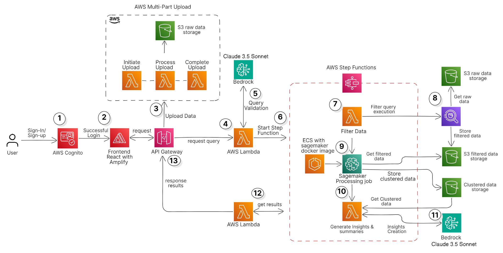

# 📊 Feedback Survey Insights

The Feedback Survey Insights project is a powerful, cloud-native solution designed to efficiently process large-scale feedback surveys. Using advanced machine learning techniques and cloud infrastructure, the system generates deep insights, actionable recommendations, and comprehensive summaries from survey data. It leverages a combination of AWS services such as Amazon SageMaker, AWS Lambda, AWS Bedrock, API Gateway, and S3 for seamless processing.

## 🌟 Key Features

- Amazon SageMaker: Employs machine learning algorithms like DBSCAN (Density-Based Spatial Clustering of Applications with Noise) to cluster survey comments, enabling the identification of recurring themes.
- AWS Bedrock: Leverages large language models (LLMs) to provide contextual insights and generate human-readable summaries from clustered feedback data, ensuring actionable recommendations.
- AWS Lambda & API Gateway: Orchestrates the workflow, including job initiation, status checking, and retrieval of insights through dynamic API endpoints.
- S3 Multi-part Upload: Efficiently handles large datasets with multi-part uploads, ensuring fast, reliable data processing by splitting files into smaller chunks for parallel upload.

## 🏗️ Architecture Overview

This system offers a robust end-to-end architecture designed for high-performance, scalable, and reliable feedback processing. From the initial dataset upload to ML processing and insights generation, the deployment leverages AWS services to ensure rapid and accurate results.



#### The architecture includes the following key components:

- S3 for Multi-part Uploads: Upload large datasets in parallel to ensure speed and reliability.
- AWS Lambda & API Gateway: Manage API requests and processing jobs.
- Amazon SageMaker: Process the data using ML clustering algorithms.
- AWS Bedrock: Generate insights and summaries using LLMs.
- Once the deployment is complete, you can use the API URLs to initiate data processing and retrieve detailed insights and summaries.

## 🛠️ Setup and Installation

#### Before you begin, ensure you have the following prerequisites:

### Prerequisites 🔑

- AWS CLI: Installed and configured with the necessary IAM permissions.
- AWS CDK: Installed globally on your system.
- Docker: Installed and running.
- AWS Account: With appropriate permissions for services such as ECR, Lambda, S3, Step Functions, and SageMaker.

### Step 1: Clone the Project 🧑‍💻

#### To get started, clone the project from GitHub:

```bash
git clone https://github.com/ASUCICREPO/feedback_survey_insights.git
cd feedback_survey_insights
```

### Step 2: Navigate to the Frontend or Backend Folder 🔍

#### This project is divided into two parts: Frontend and Backend. You can find detailed instructions for each part in their respective README files.

- Frontend Setup: Check out the Frontend README for detailed setup instructions.
- Backend Setup: Check out the Backend README for detailed setup instructions.

### Frontend Overview 🌐

The frontend provides a user-friendly interface for interacting with the Q&A bot, asking questions, applying filters, and visualizing insights. Built using React, it connects with the backend via API calls to retrieve real-time insights and summaries.

For more information on the frontend setup, refer to the [Frontend README](./Frontend/README.md).

### Backend Overview 🏗️

The backend is responsible for processing large datasets, utilizing machine learning models through Amazon SageMaker, coordinating workflows via AWS Lambda, and generating insights with LLMs through AWS Bedrock. It also handles S3 multi-part uploads to manage large survey datasets efficiently.

For more information on the backend setup, refer to the [Backend README](./Backend/README.md).

### Step 3: Deploy the CDK Stack 🚀

Once you have navigated to the backend folder and made the necessary configuration changes, you can deploy the AWS infrastructure using AWS CDK.

#### Bootstrap AWS CDK (First-Time Setup)
If you're setting up AWS CDK for the first time, run the following command to initialize your environment:

```bash
cdk bootstrap
```
### Deploy the Backend Stack

#### To deploy the infrastructure, run the following command:

```bash
cdk deploy --all
```

This will set up all the required AWS resources, including Lambda functions, S3 buckets, API Gateway, Step Functions, Glue, and SageMaker jobs. Once deployed, the CDK will output the API URLs that can be used to interact with the system.

## 🧰 Troubleshooting

If you encounter any issues during the Docker image upload, CDK deployment, or while interacting with the APIs, refer to the official AWS documentation:

- [Backend ReadMe File](./Backend/README.md)
- [Frontend ReadMe File](./Frontend/README.md)
- [AWS CDK Documentation](https://docs.aws.amazon.com/cdk/latest/guide/cli.html)
- [React Documentation](https://react.dev/)

## 📝 Pro Tip:

Make sure to deploy the backend before working on the frontend! 🛠️ This ensures that all the API endpoints , Lambda functions and all required Services are live and ready for your frontend to interact with.

## Happy coding and building with Feedback Survey Insights 💻📊✨